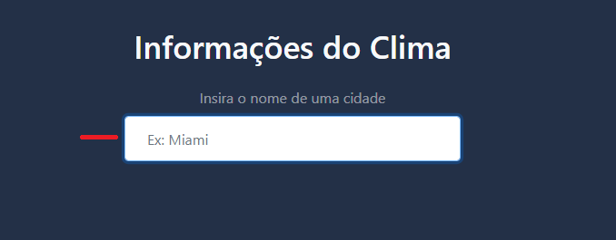
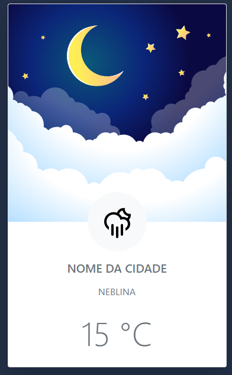

Aplicação, onde pode consultar o clima da sua cidade, que horas são...

A aplicação funciona com uma API por trás de tudo, retornando o horário, temperatura, etc

Só preencher a cidade nessa caixa, e retornará a informação da cidade

Resposta da aplicação, ao seguir os passos necessário.